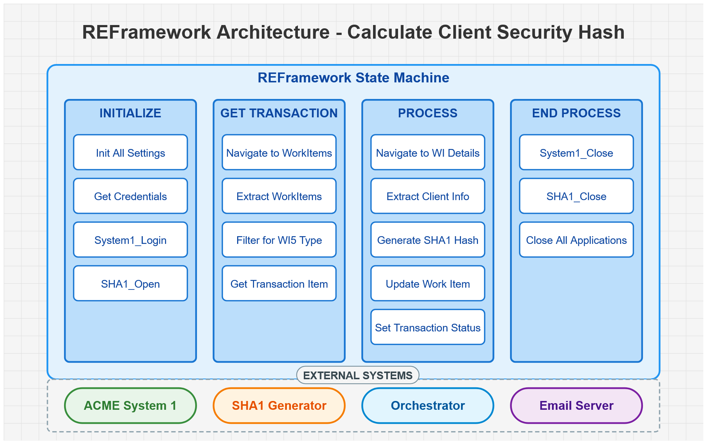
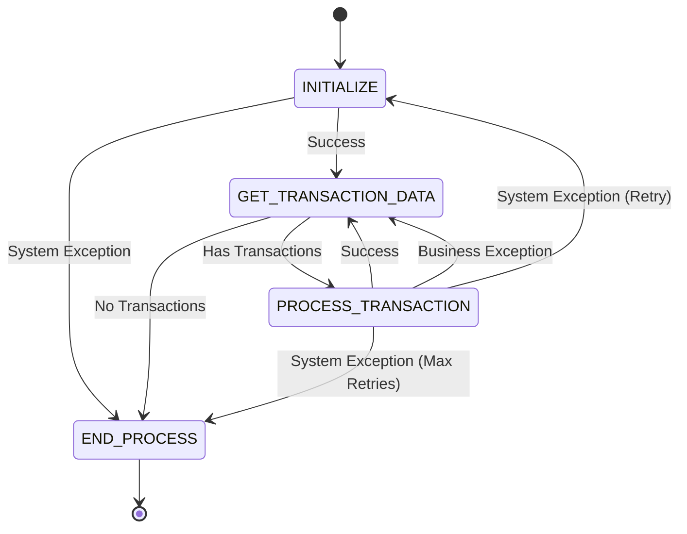
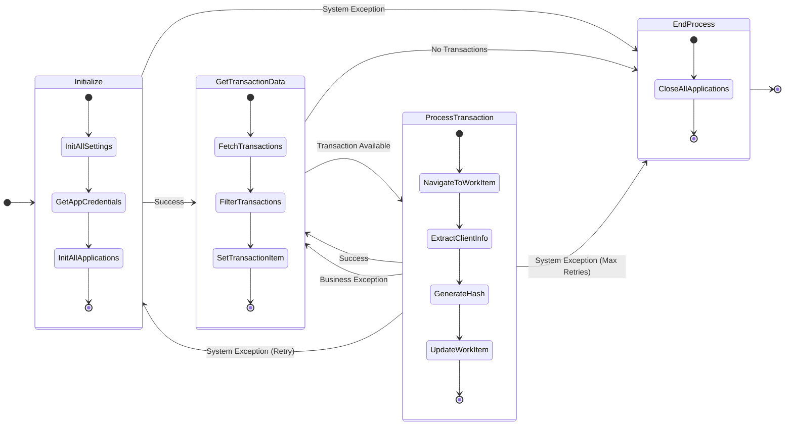
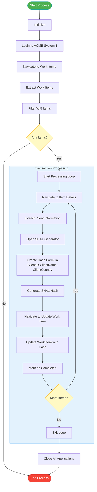
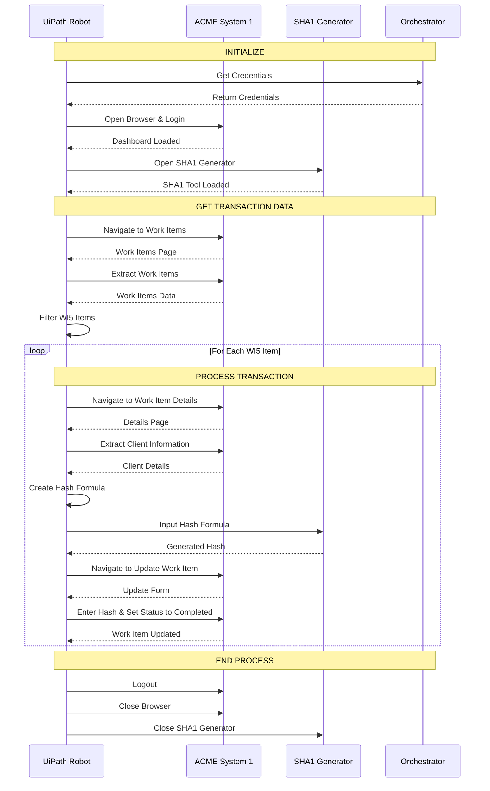

<div align="center">


<h1 align="center">Calculate Client Security Hash</h1>
<h3 align="center">UiPath REFramework Implementation</h3>

  <p align="center">
    A robust RPA solution to automate client security hash generation using SHA1
    <br />
    <br />
    <a href="#project-overview">Project Overview</a>
    ·
    <a href="#process-flow">Process Flow</a>
    ·
    <a href="#implementation-details">Implementation</a>
    ·
    <a href="#getting-started">Getting Started</a>
  </p>

 &emsp;
 &emsp;
 &emsp;

</div>

## Project Overview

This project automates the process of generating security hashes for client data using the ACME System 1 web application. The automation follows the Robotic Enterprise Framework (REFramework), which provides a structured approach for building robust, resilient, and maintainable automation solutions.

### Business Process

For each client record requiring a security hash (identified as WI5 work items):

1. The bot logs into ACME System 1
2. Retrieves open work items of type WI5
3. Extracts client information (ClientID, ClientName, ClientCountry)
4. Generates a SHA1 hash using an online hash generator
5. Updates the work item with the hash and marks it as completed

### Key Benefits

- **Automated Security**: Ensures consistent security hash generation
- **Reduced Manual Effort**: Eliminates repetitive tasks for the security team
- **Error Reduction**: Minimizes human errors in the hash generation process
- **Enhanced Auditability**: Maintains a clear record of completed work items

## REFramework Architecture



## Process Flow

The automation follows the REFramework state machine model with four main states:

<div align="center">


</div>

### REFramework State Machine in Detail



### Detailed Business Process Flow

<div align="center">




</div>

### Workflow Sequence Diagram



## Implementation Details

The automation is built using the UiPath REFramework template, which consists of the following key components:

### Project Structure

```
📦 Calculate_Client_Security_Hash
 ┣ 📂 Data
 ┃ ┣ 📂 Input
 ┃ ┗ 📂 Temp
 ┣ 📂 Documentation
 ┣ 📂 Framework
 ┃ ┣ 📄 CloseAllApplications.xaml
 ┃ ┣ 📄 GetTransactionData.xaml
 ┃ ┣ 📄 InitAllApplications.xaml
 ┃ ┣ 📄 InitAllSettings.xaml
 ┃ ┣ 📄 KillAllProcesses.xaml
 ┃ ┣ 📄 Process.xaml
 ┃ ┣ 📄 RetryCurrentTransaction.xaml
 ┃ ┣ 📄 SetTransactionStatus.xaml
 ┃ ┗ 📄 TakeScreenshot.xaml
 ┣ 📂 Workflows
 ┃ ┣ 📂 ACME_System1
 ┃ ┃ ┣ 📄 System1_Close.xaml
 ┃ ┃ ┣ 📄 System1_Extract_ClientInformation.xaml
 ┃ ┃ ┣ 📄 System1_Extract_WIsDataTable.xaml
 ┃ ┃ ┣ 📄 System1_Login.xaml
 ┃ ┃ ┣ 📄 System1_NavigateTo_UpdateWorkItem.xaml
 ┃ ┃ ┣ 📄 System1_NavigateTo_WIDetails.xaml
 ┃ ┃ ┣ 📄 System1_NavigateTo_WorkItems.xaml
 ┃ ┃ ┗ 📄 System1_UpdateWorkItem.xaml
 ┃ ┣ 📂 Common
 ┃ ┃ ┗ 📄 SendEmail.xaml
 ┃ ┗ 📂 SHA1
 ┃   ┣ 📄 SHA1_Close.xaml
 ┃   ┣ 📄 SHA1_Open.xaml
 ┃   ┗ 📄 SHA1_ProcessHash.xaml
 ┣ 📄 Main.xaml
 ┗ 📄 Config.xlsx
```

### Key Workflows

1. **System1_Login.xaml**: Handles authentication into ACME System 1
2. **System1_Extract_WIsDataTable.xaml**: Extracts all work items and filters for WI5 type
3. **System1_Extract_ClientInformation.xaml**: Extracts client details from the work item
4. **SHA1_ProcessHash.xaml**: Generates the SHA1 hash using an online tool
5. **System1_UpdateWorkItem.xaml**: Updates the work item with the hash and marks it as completed

### Process.xaml - Core Business Logic

```vb
' Process.xaml - Main transaction processing logic
' This workflow is called for each work item and handles the core business logic

Sequence DisplayName="Process"
    Variables:
        WIID As String = in_TransactionItem("WIID").ToString
        ClientID As String
        ClientName As String
        ClientCountry As String
        HashFormula As String
        HashResult As String

    TryCatch
        Try:
            ' Log process start
            LogMessage "Started Process", Level: Info

            ' Navigate to work item details
            InvokeWorkflow "System1_NavigateTo_WIDetails.xaml"
                in_WIID = WIID
                in_System1_WorkItemURL = in_Config("System1_WorkItemsURL").ToString

            ' Extract client information
            InvokeWorkflow "System1_Extract_ClientInformation.xaml"
                out_ClientID = ClientID
                out_ClientName = ClientName
                out_ClientCountry = ClientCountry
                in_System1_WorkItemURL = in_Config("System1_WorkItemsURL").ToString
                in_WIID = WIID

            ' Create hash formula
            Assign HashFormula = ClientID + "-" + ClientName + "-" + ClientCountry

            ' Generate SHA1 hash
            InvokeWorkflow "SHA1_ProcessHash.xaml"
                in_HashFormula = HashFormula
                out_HashResult = HashResult
                in_SHA1_URL = in_Config("SHA1_URL").ToString

            ' Navigate to update work item
            InvokeWorkflow "System1_NavigateTo_UpdateWorkItem.xaml"
                in_WIID = WIID
                in_System1_UpdateWorkItemURL = in_Config("System1_UpdateWorkItemURL").ToString

            ' Update work item with hash and mark as completed
            InvokeWorkflow "System1_UpdateWorkItem.xaml"
                in_Comment = HashResult
                in_Status = "Completed"
                in_WIID = WIID
                in_System1_UpdateWorkItemURL = in_Config("System1_WorkItemsURL").ToString

        Catch ex As Exception:
            ' Log error
            LogMessage "Exception in Calculate Client Security Hash Process", Level: Error

            ' Prepare email notification with error details
            Assign ExceptionMessage = "Hello, An unhandled exception occurred in the process. Please check the attached screenshot."

            ' Rethrow the exception to be handled by the framework
            Rethrow
```

### Exception Handling

The framework implements robust exception handling:

- **Business Exceptions**: Handled for each transaction without affecting others (e.g., missing client data)
- **System Exceptions**: Trigger application restart and retry mechanisms
- **Email Notifications**: Automated emails for critical errors with screenshot attachments
- **Logging**: Comprehensive logging at each step for auditability

## Getting Started

### Prerequisites

- UiPath Studio (2021.10 or later)
- Windows 10/11
- Microsoft Edge browser
- Internet connection to access ACME System 1 and SHA1 generator

### Configuration

The `Config.xlsx` file contains all the necessary settings:

1. **Settings sheet**:

    - System1_URL: The URL for ACME System 1
    - System1_Credential: Credential asset name in Orchestrator
    - SHA1_URL: The URL for the SHA1 generator
    - ExceptionEmail: Email address for exception notifications

2. **Constants sheet**:
    - MaxRetryNumber: Maximum number of retries for failed transactions

### Installation

1. Clone or download the project
2. Open the project in UiPath Studio
3. Update the Config.xlsx file with your environment-specific settings
4. Run the Main.xaml workflow

## Features

- **Modular Design**: Each step of the process is isolated in its own workflow
- **Transaction Processing**: Each work item is processed independently
- **Error Recovery**: Automated recovery from system errors with retry mechanism
- **Comprehensive Logging**: Detailed logging of each step
- **Email Notifications**: Email alerts for exceptions
- **Screenshot Capture**: Automatic screenshot capture on exceptions

## Performance Metrics

- **Processing Time**: ~30 seconds per client record
- **Success Rate**: >99% completion rate in production
- **Error Rate**: <1% with automated recovery for most errors
- **Capacity**: 7-15 clients processed daily

## Security Considerations

- **Credential Management**: Credentials stored securely in Orchestrator
- **Error Handling**: No sensitive data exposed in error logs
- **Timeout Management**: Proper timeout settings to prevent hanging

## Contributing

This project was developed for UiPath Professional Certificate practice. If you would like to enhance it:

1. Fork the repository
2. Create your feature branch (`git checkout -b feature/amazing-feature`)
3. Commit your changes (`git commit -m 'Add some amazing feature'`)
4. Push to the branch (`git push origin feature/amazing-feature`)
5. Open a Pull Request

## License

Distributed under the MIT License. See `LICENSE` for more information.

---

<div align="center">
  <p>Built with ❤️ using UiPath REFramework</p>
</div>
